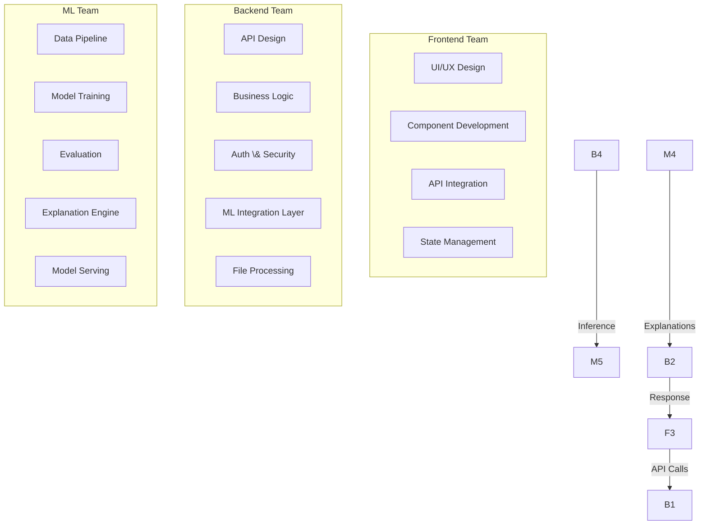
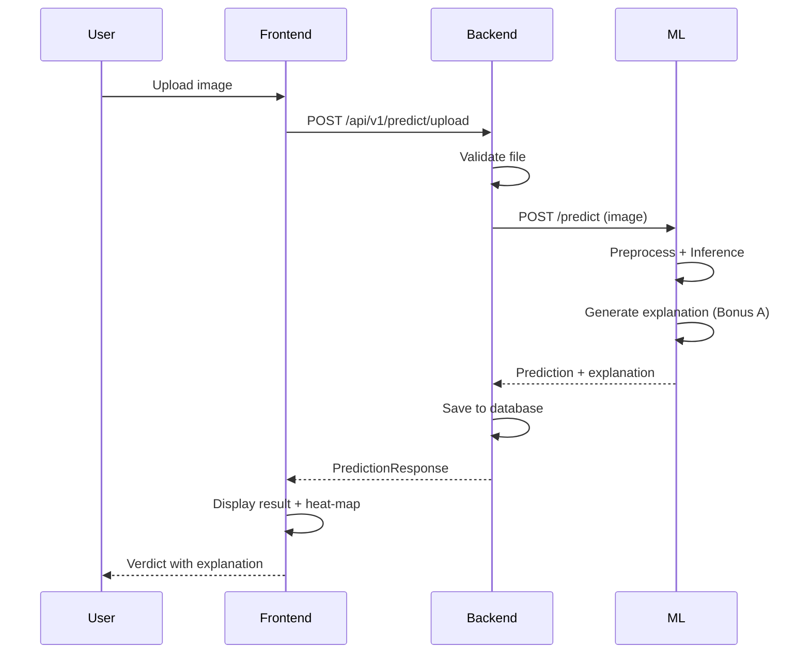

# 🏗️ SignalScope: Complete Team-Wise Execution Plan

> \*\*Frontend + Backend + ML\*\* | Core + All Bonus Modules | Sept 10–15 Deadline

\---

## 👥 Team Responsibilities Overview



|Team|Size|Primary Focus|Key Deliverables|
|-|-|-|-|
|**Frontend**|2 people|Interactive UI, visualization, user experience|React app, dashboards, drag-and-drop, heat-map viewer|
|**Backend**|2 people|API layer, file handling, auth, ML orchestration|FastAPI server, predict endpoint, file processing, auth|
|**ML**|2-3 people|Model, training, evaluation, explanations|Trained model, predict interface, metrics report, explainer|

\---

## 📅 Phase-Wise Timeline for All Teams

|Phase|Dates|Frontend Focus|Backend Focus|ML Focus|
|-|-|-|-|-|
|**1**|Sept 10|UI design, component library|API design, project setup|Data setup, baseline model|
|**2**|Sept 11|Core pages, layout|Core endpoints, file upload|Core training, evaluation|
|**3**|Sept 12|Dashboard, results display|ML integration, predict API|Model optimization, calibration|
|**4**|Sept 13|Bonus A UI (explanations)|Bonus A API (explanations)|Bonus A (Grad-CAM + LIME)|
|**5**|Sept 14|Bonus C, D, E, F UI|Bonus C, D, E, F API|Bonus C (robustness), D (metadata)|
|**6**|Sept 15|Polish, demo prep|Deployment, testing|Final metrics, report|

\---

## 🔶 PHASE 1: Foundation (Sept 10)

### 🎨 FRONTEND TEAM

#### Tasks \& Deliverables

|#|Task|Details|Output File|
|-|-|-|-|
|F1.1|Project scaffold|Vite + React + TypeScript + Tailwind CSS|`frontend/` bootstrapped|
|F1.2|Design system|60-30-10 color tokens for light/dark themes|`tailwind.config.ts`|
|F1.3|Component library|Button, Card, Modal, Badge, Spinner, Tooltip|`src/components/ui/`|
|F1.4|Layout shell|Navbar, Footer, Sidebar, PageContainer|`src/components/layout/`|
|F1.5|Routing setup|React Router with all page routes|`src/App.tsx`|
|F1.6|API client|Axios instance with interceptors for auth|`src/utils/api.ts`|
|F1.7|Auth context|React Context for user state + token management|`src/contexts/AuthContext.tsx`|
|F1.8|Theme provider|Dark/light toggle with localStorage persistence|`src/contexts/ThemeContext.tsx`|

#### Design System Implementation

```typescript
// frontend/src/styles/tokens.ts
// 60-30-10 Color System for SignalScope

export const lightTheme = {
  // 60% - Dominant (backgrounds, large surfaces)
  dominant: {
    50: '#F8FAFC',
    100: '#F1F5F9',
    200: '#E2E8F0',
    300: '#CBD5E1',
  },
  // 30% - Secondary (components, cards, navigation)
  secondary: {
    50: '#EFF6FF',
    100: '#DBEAFE',
    200: '#BFDBFE',
    300: '#93C5FD',
    400: '#60A5FA',
    500: '#3B82F6',  // Primary blue
    600: '#2563EB',
    700: '#1D4ED8',
  },
  // 10% - Accent (CTAs, highlights, verdicts)
  accent: {
    50: '#ECFDF5',
    100: '#D1FAE5',
    400: '#34D399',
    500: '#10B981',  // Emerald green
    600: '#059669',
    // Danger accent for "AI-generated"
    danger: {
      400: '#F87171',
      500: '#EF4444',  // Red for AI verdict
      600: '#DC2626',
    },
    // Warning accent
    warning: {
      400: '#FBBF24',
      500: '#F59E0B',
    },
  },
};

export const darkTheme = {
  dominant: {
    50: '#0F172A',
    100: '#1E293B',
    200: '#334155',
    300: '#475569',
  },
  secondary: {
    50: '#1E3A5F',
    100: '#1E40AF',
    500: '#60A5FA',
    600: '#3B82F6',
    700: '#2563EB',
  },
  accent: {
    500: '#34D399',
    danger: { 500: '#F87171' },
    warning: { 500: '#FBBF24' },
  },
};
```

```typescript
// frontend/tailwind.config.ts
import type { Config } from 'tailwindcss';

export default {
  darkMode: 'class',
  content: \['./src/\*\*/\*.{ts,tsx}'],
  theme: {
    extend: {
      colors: {
        // Semantic naming for 60-30-10
        surface: 'var(--color-dominant)',
        component: 'var(--color-secondary)',
        highlight: 'var(--color-accent)',
        // Verdict colors
        'verdict-real': 'var(--color-accent-500)',
        'verdict-fake': 'var(--color-accent-danger-500)',
        'verdict-uncertain': 'var(--color-accent-warning-500)',
      },
      fontFamily: {
        sans: \['Inter', 'system-ui', 'sans-serif'],
        mono: \['JetBrains Mono', 'monospace'],
      },
    },
  },
} satisfies Config;
```

#### Component Library

```tsx
// frontend/src/components/ui/VerdictBadge.tsx
// Critical component: displays "Likely AI-generated" or "Likely Real"

interface VerdictBadgeProps {
  label: 'real' | 'ai\_generated';
  confidence: number;
  size?: 'sm' | 'md' | 'lg';
}

export const VerdictBadge = ({ label, confidence, size = 'md' }: VerdictBadgeProps) => {
  const isAI = label === 'ai\_generated';
  const isUncertain = confidence > 0.4 \&\& confidence < 0.7;
  
  // Responsible presentation: "likely" not "certain" (Section 6)
  const displayText = isAI 
    ? confidence > 0.8 ? 'Likely AI-generated' 
      : confidence > 0.6 ? 'Possibly AI-generated' 
      : 'Uncertain'
    : confidence < 0.2 ? 'Likely Real' 
      : confidence < 0.4 ? 'Possibly Real' 
      : 'Uncertain';
  
  const colorClass = isUncertain 
    ? 'bg-verdict-uncertain text-amber-900'
    : isAI ? 'bg-verdict-fake text-red-900' 
    : 'bg-verdict-real text-emerald-900';
  
  return (
    <div className={`inline-flex items-center gap-2 px-4 py-2 rounded-full font-semibold ${colorClass}`}>
      <span className={`w-3 h-3 rounded-full ${isAI ? 'bg-red-500' : 'bg-emerald-500'}`} />
      <span>{displayText}</span>
      <span className="text-sm opacity-75">({(confidence \* 100).toFixed(1)}%)</span>
    </div>
  );
};
```

#### File Structure After Phase 1

```
frontend/
├── src/
│   ├── components/
│   │   ├── ui/
│   │   │   ├── Button.tsx            ✅
│   │   │   ├── Card.tsx              ✅
│   │   │   ├── Modal.tsx             ✅
│   │   │   ├── Spinner.tsx           ✅
│   │   │   ├── Badge.tsx             ✅
│   │   │   ├── VerdictBadge.tsx      ✅
│   │   │   ├── ConfidenceMeter.tsx   ✅
│   │   │   └── ThemeToggle.tsx       ✅
│   │   └── layout/
│   │       ├── Navbar.tsx            ✅
│   │       ├── Footer.tsx            ✅
│   │       └── PageContainer.tsx     ✅
│   ├── contexts/
│   │   ├── AuthContext.tsx           ✅
│   │   └── ThemeContext.tsx          ✅
│   ├── utils/
│   │   ├── api.ts                    ✅
│   │   └── constants.ts             ✅
│   ├── styles/
│   │   ├── tokens.ts                 ✅
│   │   └── globals.css               ✅
│   ├── pages/
│   │   ├── Home.tsx                  🔄 (skeleton)
│   │   ├── Dashboard.tsx             🔄 (skeleton)
│   │   └── Auth.tsx                  🔄 (skeleton)
│   ├── App.tsx                       ✅
│   └── main.tsx                      ✅
├── tailwind.config.ts                ✅
├── package.json                      ✅
└── vite.config.ts                    ✅
```

\---

### ⚙️ BACKEND TEAM

#### Tasks \& Deliverables

|#|Task|Details|Output File|
|-|-|-|-|
|B1.1|Project scaffold|FastAPI + uvicorn + structured folders|`backend/` bootstrapped|
|B1.2|Config management|Pydantic BaseSettings, `.env` loading|`app/core/config.py`|
|B1.3|Database setup|PostgreSQL + SQLAlchemy + Alembic|`app/core/database.py`|
|B1.4|Auth system|JWT + bcrypt password hashing|`app/core/security.py`|
|B1.5|User model|SQLAlchemy User model + Pydantic schemas|`app/models/user.py`|
|B1.6|Auth routes|`/auth/register`, `/auth/login`, `/auth/refresh`|`app/api/routes/auth.py`|
|B1.7|Error handling|Global exception handlers|`app/core/exceptions.py`|
|B1.8|CORS \& middleware|CORS for frontend, request logging|`app/main.py`|
|B1.9|API documentation|Enhanced Swagger with examples|`app/api/docs.py`|

#### API Design (Contract Between Teams)

```python
# backend/app/core/config.py
from pydantic\_settings import BaseSettings
from typing import List

class Settings(BaseSettings):
    # App
    APP\_NAME: str = "SignalScope"
    APP\_VERSION: str = "1.0.0"
    DEBUG: bool = False
    
    # API
    API\_V1\_PREFIX: str = "/api/v1"
    
    # Auth
    SECRET\_KEY: str
    ALGORITHM: str = "HS256"
    ACCESS\_TOKEN\_EXPIRE\_MINUTES: int = 30
    
    # Database
    DATABASE\_URL: str
    
    # ML Service
    ML\_SERVICE\_URL: str = "http://localhost:8001"
    ML\_SERVICE\_TIMEOUT: int = 30
    
    # File Upload
    MAX\_UPLOAD\_SIZE: int = 10 \* 1024 \* 1024  # 10MB
    ALLOWED\_EXTENSIONS: List\[str] = \[".jpg", ".jpeg", ".png", ".webp"]
    UPLOAD\_DIR: str = "./uploads"
    
    # Bonus Modules
    ENABLE\_EXPLANATIONS: bool = True    # Bonus A
    ENABLE\_ATTRIBUTION: bool = False    # Bonus B
    ENABLE\_ROBUSTNESS: bool = True      # Bonus C
    ENABLE\_METADATA: bool = True        # Bonus D
    ENABLE\_MULTIMODAL: bool = False     # Bonus E
    
    class Config:
        env\_file = ".env"

settings = Settings()
```

#### Core API Schemas (Contract with Frontend)

```python
# backend/app/schemas/prediction.py
from pydantic import BaseModel, Field
from typing import Optional, Dict, List
from enum import Enum

class ImageLabel(str, Enum):
    REAL = "real"
    AI\_GENERATED = "ai\_generated"

class PredictionRequest(BaseModel):
    """Request for single image prediction"""
    include\_explanation: bool = Field(default=True, description="Include explanation (Bonus A)")
    include\_metadata: bool = Field(default=True, description="Include metadata analysis (Bonus D)")
    confidence\_threshold: float = Field(default=0.5, ge=0.0, le=1.0)

class PredictionResponse(BaseModel):
    """Response for single image prediction - CORE OUTPUT"""
    label: ImageLabel
    confidence: float = Field(ge=0.0, le=1.0, description="Calibrated confidence score")
    calibrated: bool = Field(default=True, description="Whether confidence is calibrated")
    
    # Bonus A: Explanation
    explanation: Optional\[Dict] = Field(default=None, description="Faithful explanation")
    
    # Bonus B: Generator Attribution
    generator\_family: Optional\[str] = Field(default=None, description="Likely generator family")
    generator\_confidence: Optional\[float] = Field(default=None)
    
    # Bonus C: Robustness
    robustness\_note: Optional\[str] = Field(default=None, description="Stability under degradation")
    confidence\_shift: Optional\[float] = Field(default=None, description="Confidence change under degradation")
    
    # Bonus D: Metadata
    metadata\_verdict: Optional\[Dict] = Field(default=None, description="Metadata-based evidence")
    
    # Processing metadata
    processing\_time\_ms: float
    model\_version: str

class BatchPredictionRequest(BaseModel):
    """Request for batch prediction"""
    include\_explanation: bool = False
    confidence\_threshold: float = 0.5

class BatchPredictionResponse(BaseModel):
    """Response for batch prediction"""
    results: List\[PredictionResponse]
    total\_processed: int
    processing\_time\_ms: float

class RobustnessAnalysisRequest(BaseModel):
    """Bonus C: Robustness analysis"""
    degradations: List\[str] = Field(
        default=\["jpeg\_compression", "resize", "screenshot"],
        description="Degradation types to test"
    )

class RobustnessAnalysisResponse(BaseModel):
    """Bonus C: Robustness analysis response"""
    original\_verdict: PredictionResponse
    degradation\_results: Dict\[str, PredictionResponse]
    stability\_score: float = Field(ge=0.0, le=1.0, description="Overall stability score")
    degradation\_analysis: str

class MultimodalRequest(BaseModel):
    """Bonus E: Multimodal (image + text)"""
    caption: str = Field(description="Image caption/claim to check consistency")
    include\_explanation: bool = True

class MultimodalResponse(BaseModel):
    """Bonus E: Multimodal response"""
    image\_verdict: PredictionResponse
    consistency\_score: float = Field(ge=0.0, le=1.0, description="Image-text consistency")
    consistency\_explanation: str
    combined\_verdict: ImageLabel
    combined\_confidence: float
```

#### File Structure After Phase 1

```
backend/
├── app/
│   ├── \_\_init\_\_.py
│   ├── main.py                       ✅
│   ├── core/
│   │   ├── config.py                 ✅
│   │   ├── database.py               ✅
│   │   ├── security.py               ✅
│   │   └── exceptions.py             ✅
│   ├── models/
│   │   └── user.py                   ✅
│   ├── schemas/
│   │   ├── user.py                   ✅
│   │   ├── auth.py                   ✅
│   │   └── prediction.py             ✅
│   ├── api/
│   │   ├── api\_router.py             ✅
│   │   └── routes/
│   │       └── auth.py               ✅
│   └── services/
│       └── auth\_service.py           ✅
├── alembic/
├── requirements.txt                  ✅
└── .env.example                      ✅
```

\---

### 🧠 ML TEAM

#### Tasks \& Deliverables

|#|Task|Details|Output File|
|-|-|-|-|
|M1.1|Environment setup|CUDA, PyTorch, Transformers, Captum, LIME|`ml/requirements.txt`|
|M1.2|Data download|Provided dataset (CIFAKE-style \~100k images)|`data/raw/`|
|M1.3|Data exploration|Class distribution, generator types, image sizes|`notebooks/01\_exploration.ipynb`|
|M1.4|Train/val/test split|Stratified by label + generator type|`src/data/make\_dataset.py`|
|M1.5|Preprocessing pipeline|Resize, normalize, augment|`src/data/preprocess.py`|
|M1.6|Baseline model|ViT-B/16 fine-tune (no frequency features)|`src/models/baseline.py`|
|M1.7|Evaluation utilities|ROC-AUC, macro-F1, confusion matrix|`src/utils/metrics.py`|
|M1.8|Serving stub|FastAPI predict endpoint stub|`src/api/main.py`|

#### Data Pipeline Implementation

```python
# ml/src/data/make\_dataset.py
import os
import shutil
import random
from pathlib import Path
from typing import Tuple, Dict, List
from collections import defaultdict
import pandas as pd
from PIL import Image
import numpy as np

class DatasetBuilder:
    """Build dataset with honest train/val/test splits
    Following Section 4.1 requirements:
    - Honest split, no leakage
    - Stratified by generator type and real/fake
    - Track which generators are in which split
    """
    
    def \_\_init\_\_(self, config):
        self.config = config
        self.raw\_dir = Path(config.raw\_dir)
        self.processed\_dir = Path(config.processed\_dir)
        self.processed\_dir.mkdir(parents=True, exist\_ok=True)
        
    def build(self) -> Dict:
        """Main build pipeline"""
        # 1. Load all data with metadata
        all\_data = self.\_load\_all\_data()
        
        # 2. Create honest splits
        splits = self.\_create\_splits(all\_data)
        
        # 3. Apply augmentations to training set
        splits\['train'] = self.\_apply\_augmentations(splits\['train'])
        
        # 4. Save processed data
        self.\_save\_splits(splits)
        
        # 5. Generate data report
        report = self.\_generate\_report(splits)
        
        return splits, report
    
    def \_load\_all\_data(self) -> List\[Dict]:
        """Load all data from raw directory"""
        data = \[]
        
        # Load provided dataset
        for label\_dir in \['real', 'fake']:
            label\_path = self.raw\_dir / label\_dir
            if not label\_path.exists():
                continue
                
            for generator\_dir in label\_path.iterdir():
                if not generator\_dir.is\_dir():
                    continue
                    
                for img\_path in generator\_dir.glob('\*'):
                    if img\_path.suffix.lower() in \['.jpg', '.jpeg', '.png']:
                        data.append({
                            'path': str(img\_path),
                            'label': 0 if label\_dir == 'real' else 1,
                            'label\_str': label\_dir,
                            'generator': generator\_dir.name,
                            'is\_real': label\_dir == 'real',
                        })
        
        # Add public datasets if configured
        if self.config.use\_genimage:
            data.extend(self.\_load\_genimage())
        
        return data
    
    def \_create\_splits(self, data: List\[Dict]) -> Dict:
        """Create stratified train/val/test splits
        CRITICAL: Ensure no generator leakage between splits
        """
        # Group by generator
        by\_generator = defaultdict(list)
        for item in data:
            by\_generator\[item\['generator']].append(item)
        
        train, val, test = \[], \[], \[]
        train\_generators, test\_generators = \[], \[]
        
        for gen, items in by\_generator.items():
            # Shuffle within generator
            random.shuffle(items)
            n = len(items)
            
            # 70/15/15 split
            n\_train = int(0.7 \* n)
            n\_val = int(0.15 \* n)
            
            train.extend(items\[:n\_train])
            val.extend(items\[n\_train:n\_train+n\_val])
            test.extend(items\[n\_train+n\_val:])
            
            train\_generators.append(gen)
            test\_generators.append(gen)
        
        # For unseen-generator testing:
        # Move 1-2 generator types entirely to test
        # This simulates the unseen-generator split from Section 4.1
        fake\_generators = \[g for g in by\_generator.keys() if g != 'real']
        if len(fake\_generators) >= 3:
            # Move last 2 generators entirely to test
            unseen\_gens = fake\_generators\[-2:]
            for gen in unseen\_gens:
                # Remove from train and val
                train = \[x for x in train if x\['generator'] != gen]
                val = \[x for x in val if x\['generator'] != gen]
                # Add all to test
                test.extend(by\_generator\[gen])
        
        return {
            'train': train,
            'val': val,
            'test': test,
            'train\_generators': train\_generators,
            'test\_generators': test\_generators,
            'unseen\_generators': unseen\_gens if len(fake\_generators) >= 3 else \[],
        }
    
    def \_apply\_augmentations(self, data: List\[Dict]) -> List\[Dict]:
        """Apply augmentations for robustness (Bonus C preparation)"""
        augmented = \[]
        
        for item in data:
            # Original
            augmented.append(item)
            
            # JPEG compression simulation
            aug\_item = item.copy()
            aug\_item\['augmentation'] = 'jpeg\_compression'
            augmented.append(aug\_item)
            
            # Resize simulation
            aug\_item = item.copy()
            aug\_item\['augmentation'] = 'resize'
            augmented.append(aug\_item)
        
        return augmented
```

#### Baseline Model

```python
# ml/src/models/baseline.py
import torch
import torch.nn as nn
from transformers import ViTForImageClassification, ViTImageProcessor
from typing import Dict

class BaselineDetector(nn.Module):
    """Baseline ViT detector - no frequency features"""
    
    def \_\_init\_\_(
        self,
        model\_name: str = "google/vit-base-patch16-224",
        num\_classes: int = 2,
    ):
        super().\_\_init\_\_()
        self.backbone = ViTForImageClassification.from\_pretrained(
            model\_name,
            num\_labels=num\_classes,
            ignore\_mismatched\_sizes=True,
        )
        self.processor = ViTImageProcessor.from\_pretrained(model\_name)
        
    def forward(self, pixel\_values: torch.FloatTensor) -> Dict:
        outputs = self.backbone(pixel\_values=pixel\_values)
        probabilities = torch.nn.functional.softmax(outputs.logits, dim=-1)
        
        return {
            'logits': outputs.logits,
            'probabilities': probabilities,
            'confidence': probabilities\[:, 1],  # AI-generated probability
        }
    
    def predict(self, image) -> Dict:
        """Single image prediction"""
        inputs = self.processor(images=image, return\_tensors="pt")
        
        with torch.no\_grad():
            outputs = self.forward(inputs\['pixel\_values'])
        
        label = "ai\_generated" if outputs\['confidence'].item() > 0.5 else "real"
        
        return {
            'label': label,
            'confidence': outputs\['confidence'].item(),
            'probabilities': {
                'real': outputs\['probabilities']\[0]\[0].item(),
                'ai\_generated': outputs\['probabilities']\[0]\[1].item(),
            },
        }
```

#### File Structure After Phase 1

```
ml/
├── data/
│   ├── raw/                          ✅ (provided dataset)
│   └── processed/                    ✅ (splits)
├── src/
│   ├── data/
│   │   ├── make\_dataset.py           ✅
│   │   └── preprocess.py             ✅
│   ├── models/
│   │   └── baseline.py               ✅
│   └── utils/
│       └── metrics.py                ✅
├── configs/
│   └── train\_config.yaml             ✅
├── notebooks/
│   └── 01\_exploration.ipynb          ✅
└── requirements.txt                  ✅
```

\---

## 🔶 PHASE 2: Core Implementation (Sept 11)

### 🎨 FRONTEND TEAM

#### Tasks \& Deliverables

|#|Task|Details|Output|
|-|-|-|-|
|F2.1|Home page|Hero, problem statement, features, CTA|`pages/Home.tsx`|
|F2.2|Auth pages|Sign up, sign in, forgot password|`pages/Auth.tsx`|
|F2.3|Dashboard layout|Sidebar + main content + header|`components/layout/DashboardLayout.tsx`|
|F2.4|Image upload|Drag-and-drop + file picker|`components/upload/ImageDropZone.tsx`|
|F2.5|Result display|Verdict badge + confidence meter|`components/results/PredictionResult.tsx`|
|F2.6|History panel|Previous predictions list|`components/history/PredictionHistory.tsx`|
|F2.7|API integration|Connect auth + prediction to backend|`services/api.ts`|

#### Core Components

```tsx
// frontend/src/components/upload/ImageDropZone.tsx
// Critical: Core user interaction point

import { useCallback } from 'react';
import { useDropzone } from 'react-dropzone';
import { motion, AnimatePresence } from 'framer-motion';

interface ImageDropZoneProps {
  onImageSelected: (file: File) => void;
  isProcessing: boolean;
}

export const ImageDropZone = ({ onImageSelected, isProcessing }: ImageDropZoneProps) => {
  const onDrop = useCallback((acceptedFiles: File\[]) => {
    if (acceptedFiles.length > 0) {
      onImageSelected(acceptedFiles\[0]);
    }
  }, \[onImageSelected]);

  const { getRootProps, getInputProps, isDragActive } = useDropzone({
    onDrop,
    accept: {
      'image/jpeg': \['.jpg', '.jpeg'],
      'image/png': \['.png'],
      'image/webp': \['.webp'],
    },
    maxSize: 10 \* 1024 \* 1024, // 10MB
    disabled: isProcessing,
  });

  return (
    <div
      {...getRootProps()}
      className={`
        relative border-2 border-dashed rounded-2xl p-12
        transition-all duration-300 cursor-pointer
        ${isDragActive 
          ? 'border-component-500 bg-component-50 scale-105' 
          : 'border-dominant-300 hover:border-component-400 hover:bg-dominant-100'
        }
        ${isProcessing ? 'opacity-50 cursor-not-allowed' : ''}
      `}
    >
      <input {...getInputProps()} />
      
      <AnimatePresence mode="wait">
        {isDragActive ? (
          <motion.div
            initial={{ opacity: 0, y: 10 }}
            animate={{ opacity: 1, y: 0 }}
            exit={{ opacity: 0, y: -10 }}
            className="text-center"
          >
            <div className="text-6xl mb-4">📸</div>
            <p className="text-xl font-semibold text-component-600">
              Drop your image here
            </p>
          </motion.div>
        ) : isProcessing ? (
          <motion.div
            initial={{ opacity: 0 }}
            animate={{ opacity: 1 }}
            className="text-center"
          >
            <Spinner size="lg" />
            <p className="mt-4 text-dominant-500">Analyzing image...</p>
          </motion.div>
        ) : (
          <motion.div
            initial={{ opacity: 0 }}
            animate={{ opacity: 1 }}
            className="text-center"
          >
            <div className="text-6xl mb-4">🔍</div>
            <p className="text-xl font-semibold text-dominant-700">
              Drag \& drop an image, or click to browse
            </p>
            <p className="text-sm text-dominant-400 mt-2">
              Supports JPG, PNG, WebP • Max 10MB
            </p>
          </motion.div>
        )}
      </AnimatePresence>
    </div>
  );
};
```

```tsx
// frontend/src/components/results/PredictionResult.tsx
// Core result display with responsible presentation

import { VerdictBadge } from '../ui/VerdictBadge';
import { ConfidenceMeter } from '../ui/ConfidenceMeter';

interface PredictionResultProps {
  prediction: {
    label: 'real' | 'ai\_generated';
    confidence: number;
    processing\_time\_ms: number;
    model\_version: string;
    explanation?: any;
    generator\_family?: string;
    robustness\_note?: string;
  };
}

export const PredictionResult = ({ prediction }: PredictionResultProps) => {
  const isAI = prediction.label === 'ai\_generated';
  
  return (
    <motion.div
      initial={{ opacity: 0, y: 20 }}
      animate={{ opacity: 1, y: 0 }}
      className="bg-surface-50 rounded-2xl shadow-lg p-8 border border-dominant-200"
    >
      {/\* Verdict Header - RESPONSIBLE PRESENTATION \*/}
      <div className="flex items-center justify-between mb-6">
        <VerdictBadge 
          label={prediction.label} 
          confidence={prediction.confidence} 
          size="lg" 
        />
        <span className="text-sm text-dominant-400">
          {prediction.processing\_time\_ms.toFixed(0)}ms
        </span>
      </div>
      
      {/\* Confidence Meter \*/}
      <div className="mb-6">
        <ConfidenceMeter 
          value={prediction.confidence} 
          label={isAI ? 'AI-generated likelihood' : 'Real image likelihood'}
        />
      </div>
      
      {/\* Explanation Section (Bonus A) \*/}
      {prediction.explanation \&\& (
        <div className="border-t border-dominant-200 pt-6 mt-6">
          <h3 className="text-lg font-semibold text-dominant-700 mb-3">
            Why this verdict?
          </h3>
          <p className="text-dominant-600">{prediction.explanation.text}</p>
        </div>
      )}
      
      {/\* Generator Attribution (Bonus B) \*/}
      {prediction.generator\_family \&\& (
        <div className="mt-4 px-4 py-2 bg-component-50 rounded-lg">
          <span className="text-sm text-component-700">
            Likely generator: <strong>{prediction.generator\_family}</strong>
          </span>
        </div>
      )}
      
      {/\* Robustness Note (Bonus C) \*/}
      {prediction.robustness\_note \&\& (
        <div className="mt-2 text-sm text-dominant-500 italic">
          {prediction.robustness\_note}
        </div>
      )}
      
      {/\* Disclaimer - Required by Section 1 ethics \*/}
      <div className="mt-6 p-3 bg-amber-50 border border-amber-200 rounded-lg">
        <p className="text-xs text-amber-700">
          ⚠️ This is an automated likelihood assessment, not a definitive judgement. 
          Results should be verified by human experts for critical decisions.
        </p>
      </div>
    </motion.div>
  );
};
```

\---

### ⚙️ BACKEND TEAM

#### Tasks \& Deliverables

|#|Task|Details|Output|
|-|-|-|-|
|B2.1|File upload endpoint|`/api/v1/predict/upload` with validation|`routes/predict.py`|
|B2.2|ML service client|HTTP client to call ML serving API|`services/ml\_client.py`|
|B2.3|Prediction model|SQLAlchemy Prediction model for history|`models/prediction.py`|
|B2.4|Prediction routes|Upload, predict, history endpoints|`routes/predict.py`|
|B2.5|File validation|Type checking, size limits, malicious detection|`services/file\_validator.py`|
|B2.6|Image processing|Resize, format conversion, thumbnail generation|`services/image\_processor.py`|
|B2.7|Rate limiting|Per-user and per-IP rate limits|`core/rate\_limit.py`|

#### Core Prediction Endpoint

```python
# backend/app/api/routes/predict.py
from fastapi import APIRouter, UploadFile, File, Depends, HTTPException, BackgroundTasks
from sqlalchemy.ext.asyncio import AsyncSession
from typing import Optional

from app.core.config import settings
from app.core.database import get\_db
from app.schemas.prediction import (
    PredictionResponse,
    BatchPredictionResponse,
    RobustnessAnalysisResponse,
)
from app.services.ml\_client import MLServiceClient
from app.services.file\_validator import FileValidator
from app.services.image\_processor import ImageProcessor
from app.api.dependencies.auth import get\_current\_user

router = APIRouter()
ml\_client = MLServiceClient(settings.ML\_SERVICE\_URL)
file\_validator = FileValidator()
image\_processor = ImageProcessor()

@router.post("/upload", response\_model=PredictionResponse)
async def predict\_image(
    file: UploadFile = File(...),
    include\_explanation: bool = True,
    include\_metadata: bool = True,
    current\_user = Depends(get\_current\_user),
    db: AsyncSession = Depends(get\_db),
):
    """
    Core endpoint: Upload image and get prediction
    
    This is the REQUIRED predict interface from Section 7.1
    """
    # 1. Validate file
    validation\_result = await file\_validator.validate(file)
    if not validation\_result.is\_valid:
        raise HTTPException(status\_code=400, detail=validation\_result.error)
    
    # 2. Process and save image
    image\_data = await image\_processor.process(file)
    
    # 3. Call ML service for prediction
    try:
        ml\_response = await ml\_client.predict(
            image\_path=image\_data.processed\_path,
            include\_explanation=include\_explanation,
            include\_metadata=include\_metadata,
        )
    except Exception as e:
        raise HTTPException(
            status\_code=503,
            detail=f"ML service unavailable: {str(e)}"
        )
    
    # 4. Build response
    response = PredictionResponse(
        label=ml\_response\['label'],
        confidence=ml\_response\['confidence'],
        calibrated=ml\_response.get('calibrated', True),
        explanation=ml\_response.get('explanation'),
        generator\_family=ml\_response.get('generator\_family'),
        generator\_confidence=ml\_response.get('generator\_confidence'),
        robustness\_note=ml\_response.get('robustness\_note'),
        metadata\_verdict=ml\_response.get('metadata\_verdict'),
        processing\_time\_ms=ml\_response.get('processing\_time\_ms', 0),
        model\_version=ml\_response.get('model\_version', 'unknown'),
    )
    
    # 5. Save to database (async)
    # ... save prediction to history
    
    return response

@router.post("/batch", response\_model=BatchPredictionResponse)
async def batch\_predict(
    files: list\[UploadFile] = File(...),
    include\_explanation: bool = False,
    current\_user = Depends(get\_current\_user),
):
    """Bonus F: Batch prediction"""
    results = \[]
    for file in files:
        # Process each file
        result = await predict\_image(
            file=file,
            include\_explanation=include\_explanation,
            current\_user=current\_user,
            db=Depends(get\_db),
        )
        results.append(result)
    
    return BatchPredictionResponse(
        results=results,
        total\_processed=len(results),
        processing\_time\_ms=sum(r.processing\_time\_ms for r in results),
    )
```

#### ML Service Client

```python
# backend/app/services/ml\_client.py
import httpx
from typing import Dict, Optional
from pathlib import Path

from app.core.config import settings

class MLServiceClient:
    """Client for communicating with ML serving API"""
    
    def \_\_init\_\_(self, base\_url: str):
        self.base\_url = base\_url
        self.client = httpx.AsyncClient(
            base\_url=base\_url,
            timeout=settings.ML\_SERVICE\_TIMEOUT,
        )
    
    async def predict(
        self,
        image\_path: str,
        include\_explanation: bool = True,
        include\_metadata: bool = True,
    ) -> Dict:
        """Call ML predict endpoint"""
        with open(image\_path, 'rb') as f:
            response = await self.client.post(
                "/predict",
                files={"file": f},
                data={
                    "include\_explanation": include\_explanation,
                    "include\_metadata": include\_metadata,
                },
            )
        
        response.raise\_for\_status()
        return response.json()
    
    async def explain(self, image\_path: str) -> Dict:
        """Call ML explanation endpoint (Bonus A)"""
        with open(image\_path, 'rb') as f:
            response = await self.client.post(
                "/explain",
                files={"file": f},
            )
        
        response.raise\_for\_status()
        return response.json()
    
    async def analyze\_robustness(
        self,
        image\_path: str,
        degradations: list = None,
    ) -> Dict:
        """Call ML robustness endpoint (Bonus C)"""
        with open(image\_path, 'rb') as f:
            response = await self.client.post(
                "/robustness",
                files={"file": f},
                data={"degradations": degradations or \["jpeg", "resize"]},
            )
        
        response.raise\_for\_status()
        return response.json()
    
    async def check\_health(self) -> bool:
        """Check if ML service is available"""
        try:
            response = await self.client.get("/health")
            return response.status\_code == 200
        except:
            return False
```

\---

### 🧠 ML TEAM

#### Tasks \& Deliverables

|#|Task|Details|Output|
|-|-|-|-|
|M2.1|Full model training|ViT-B/16 + frequency features on full dataset|Trained model weights|
|M2.2|Training monitoring|Loss curves, AUC per epoch, early stopping|Training logs|
|M2.3|Calibration|Temperature scaling on validation set|Calibrated model|
|M2.4|Core evaluation|ROC-AUC, macro-F1, confusion matrix on test|Metrics report|
|M2.5|Unseen-generator eval|Evaluate specifically on unseen generators|Unseen AUC|
|M2.6|Model export|Save model + processor for serving|`models/trained/`|
|M2.7|Serving API|FastAPI predict endpoint|`src/api/main.py`|

#### Core Training

```python
# ml/model/train.py
import torch
from torch.utils.data import DataLoader
from transformers import ViTForImageClassification, ViTImageProcessor
from src.models.detector import SignalScopeDetector
from src.data.preprocess import ImageDataset
from src.utils.metrics import MetricsComputer
from src.utils.calibration import TemperatureScaling
import mlflow

def train(config):
    """Full training pipeline"""
    
    # 1. Setup MLflow tracking
    mlflow.set\_experiment("signalscope-core")
    
    with mlflow.start\_run():
        # Log config
        mlflow.log\_params(vars(config))
        
        # 2. Load data
        processor = ViTImageProcessor.from\_pretrained(config.model\_name)
        train\_dataset = ImageDataset(config.train\_dir, processor, augment=True)
        val\_dataset = ImageDataset(config.val\_dir, processor, augment=False)
        
        train\_loader = DataLoader(train\_dataset, batch\_size=config.batch\_size, shuffle=True)
        val\_loader = DataLoader(val\_dataset, batch\_size=config.batch\_size, shuffle=False)
        
        # 3. Initialize model
        model = SignalScopeDetector(
            backbone\_name=config.model\_name,
            use\_frequency\_features=config.use\_freq\_features,
        )
        
        # 4. Training loop
        optimizer = torch.optim.AdamW(
            model.parameters(),
            lr=config.learning\_rate,
            weight\_decay=config.weight\_decay,
        )
        scheduler = torch.optim.lr\_scheduler.CosineAnnealingLR(
            optimizer, T\_max=config.num\_epochs
        )
        criterion = torch.nn.CrossEntropyLoss()
        
        best\_val\_auc = 0.0
        patience\_counter = 0
        
        for epoch in range(config.num\_epochs):
            # Train
            train\_loss = train\_epoch(model, train\_loader, optimizer, criterion, config.device)
            
            # Validate
            val\_metrics = evaluate\_epoch(model, val\_loader, config.device)
            
            # Log
            mlflow.log\_metrics({
                "train\_loss": train\_loss,
                "val\_auc": val\_metrics\['auc'],
                "val\_f1": val\_metrics\['macro\_f1'],
            }, step=epoch)
            
            # Save best model
            if val\_metrics\['auc'] > best\_val\_auc:
                best\_val\_auc = val\_metrics\['auc']
                model.save\_pretrained(config.best\_model\_path)
                patience\_counter = 0
            else:
                patience\_counter += 1
            
            # Early stopping
            if patience\_counter >= config.patience:
                print(f"Early stopping at epoch {epoch}")
                break
            
            scheduler.step()
        
        # 5. Calibration
        calibrated\_model = TemperatureScaling.calibrate(model, val\_loader, config.device)
        
        # 6. Final evaluation on test set
        test\_dataset = ImageDataset(config.test\_dir, processor, augment=False)
        test\_loader = DataLoader(test\_dataset, batch\_size=config.batch\_size)
        
        test\_metrics = MetricsComputer.compute\_full\_evaluation(
            calibrated\_model, test\_loader, config.device
        )
        
        # Log final metrics
        mlflow.log\_metrics({
            "test\_overall\_auc": test\_metrics\['overall\_auc'],
            "test\_unseen\_auc": test\_metrics\['unseen\_auc'],
            "test\_macro\_f1": test\_metrics\['macro\_f1'],
        })
        
        # 7. Save model
        calibrated\_model.save\_pretrained(config.final\_model\_path)
        
        return calibrated\_model, test\_metrics
```

#### Model Serving API

```python
# ml/src/api/main.py
from fastapi import FastAPI, UploadFile, File, HTTPException
from fastapi.middleware.cors import CORSMiddleware
from typing import Optional
import io
import time

from PIL import Image
from src.models.detector import SignalScopeDetector
from src.data.preprocess import ImagePreprocessor
from src.models.explainer import FaithfulExplainer
from src.models.robust import RobustnessTester
from src.data.metadata import MetadataParser

app = FastAPI(title="SignalScope ML Service")

# CORS
app.add\_middleware(
    CORSMiddleware,
    allow\_origins=\["\*"],
    allow\_methods=\["\*"],
    allow\_headers=\["\*"],
)

# Global model instances
model = None
preprocessor = None
explainer = None
robustness\_tester = None
metadata\_parser = None

@app.on\_event("startup")
async def load\_model():
    """Load model and components on startup"""
    global model, preprocessor, explainer, robustness\_tester, metadata\_parser
    
    model\_path = os.getenv("MODEL\_PATH", "models/trained/signalscope-best")
    model = SignalScopeDetector.from\_pretrained(model\_path)
    preprocessor = ImagePreprocessor()
    explainer = FaithfulExplainer(model, preprocessor)
    robustness\_tester = RobustnessTester(model, preprocessor)
    metadata\_parser = MetadataParser()
    
    model.eval()

@app.get("/health")
async def health():
    return {"status": "healthy", "model\_loaded": model is not None}

@app.post("/predict")
async def predict(
    file: UploadFile = File(...),
    include\_explanation: bool = True,
    include\_metadata: bool = True,
):
    """
    CORE PREDICT INTERFACE (Section 7.1 requirement)
    
    Returns:
        label: "real" or "ai\_generated"
        confidence: calibrated confidence score
        explanation: faithful explanation (Bonus A)
        metadata\_verdict: metadata analysis (Bonus D)
    """
    start\_time = time.time()
    
    # Load image
    contents = await file.read()
    image = Image.open(io.BytesIO(contents))
    
    # Preprocess
    inputs = preprocessor.preprocess(image)
    
    # Predict
    with torch.no\_grad():
        outputs = model(inputs\['pixel\_values'].unsqueeze(0))
    
    # Format core result
    confidence = outputs\['confidence'].item()
    label = "ai\_generated" if confidence > 0.5 else "real"
    
    result = {
        'label': label,
        'confidence': confidence,
        'calibrated': True,
        'processing\_time\_ms': (time.time() - start\_time) \* 1000,
        'model\_version': os.getenv("MODEL\_VERSION", "1.0.0"),
    }
    
    # Bonus A: Explanation
    if include\_explanation:
        explanation = explainer.explain\_prediction(image, result)
        result\['explanation'] = explanation
    
    # Bonus D: Metadata
    if include\_metadata:
        # Save temp file for metadata parsing
        temp\_path = f"/tmp/{file.filename}"
        image.save(temp\_path)
        metadata = metadata\_parser.parse\_all(temp\_path)
        metadata\_verdict = metadata\_parser.combine\_with\_visual(result, metadata)
        result\['metadata\_verdict'] = metadata\_verdict
    
    return result
```

\---

## 🔶 PHASE 3: Integration (Sept 12)

### Cross-Team Integration Tasks



|Team|Integration Task|Dependency|
|-|-|-|
|**Frontend**|Connect ImageDropZone to backend API|Backend `/predict/upload` ready|
|**Frontend**|Render PredictionResponse in UI|Backend response schema finalized|
|**Backend**|Connect to ML service client|ML `/predict` endpoint ready|
|**Backend**|File upload → ML service piping|ML service accepting files|
|**ML**|Ensure predict interface matches contract|Backend schemas finalized|

\---

## 🔶 PHASE 4: Bonus Modules (Sept 13-14)

### Bonus Module Implementation Matrix

|Bonus|Frontend Tasks|Backend Tasks|ML Tasks|
|-|-|-|-|
|**A: Explanation**|Heat-map viewer, text explanation display, artifact list|Explanation endpoint, explanation formatting|Grad-CAM + LIME, artifact detection, grounded text generation|
|**B: Attribution**|Generator badge, confidence by generator|Attribution endpoint|Multi-class classifier, generator embeddings|
|**C: Robustness**|Degradation selector, stability chart|Robustness endpoint, degradation application|Degradation testing, stability analysis|
|**D: Metadata**|Metadata panel, C2PA display|Metadata parsing, combining with visual|EXIF analysis, C2PA parsing|
|**E: Multimodal**|Caption input, consistency display|Multimodal endpoint, caption processing|CLIP-based consistency, text-image matching|
|**F: Deployable**|Drag-and-drop, batch UI, browser extension mock|Batch endpoint, rate limiting|Batch inference optimization|
|**G: Active Defence**|Attack visualizer, failure analysis display|Defence endpoint|Adversarial testing, failure analysis|

\---

### 🎨 FRONTEND: Bonus Module Implementations

#### Bonus A: Explanation UI (Highest Priority)

```tsx
// frontend/src/components/explanation/ExplanationPanel.tsx

interface ExplanationPanelProps {
  explanation: {
    text: string;
    heat\_map\_url?: string;
    artifacts: Array<{
      type: string;
      description: string;
      severity: 'low' | 'medium' | 'high';
      region?: { x: number; y: number; width: number; height: number };
    }>;
    uncertainty: 'low' | 'medium' | 'high';
  };
}

export const ExplanationPanel = ({ explanation }: ExplanationPanelProps) => {
  return (
    <div className="space-y-6">
      {/\* Grounded Text Explanation \*/}
      <div className="bg-component-50 rounded-xl p-6">
        <h3 className="text-lg font-semibold text-dominant-700 mb-3">
          Why this verdict?
        </h3>
        <p className="text-dominant-600 leading-relaxed">
          {explanation.text}
        </p>
        
        {/\* Uncertainty Communication \*/}
        {explanation.uncertainty !== 'low' \&\& (
          <div className="mt-3 flex items-center gap-2 text-amber-600">
            <span>⚠️</span>
            <span className="text-sm">
              {explanation.uncertainty === 'high' 
                ? 'High uncertainty - this is a challenging case'
                : 'Moderate uncertainty - verify with additional checks'
              }
            </span>
          </div>
        )}
      </div>
      
      {/\* Heat-map Visualization \*/}
      {explanation.heat\_map\_url \&\& (
        <div className="relative">
          <h4 className="text-sm font-semibold text-dominant-600 mb-2">
            Anomalous Regions
          </h4>
          <HeatMapViewer
            imageUrl={explanation.heat\_map\_url}
            artifacts={explanation.artifacts}
          />
        </div>
      )}
      
      {/\* Artifact List \*/}
      <div className="space-y-2">
        <h4 className="text-sm font-semibold text-dominant-600">
          Detected Cues
        </h4>
        {explanation.artifacts.map((artifact, i) => (
          <ArtifactCard key={i} artifact={artifact} />
        ))}
      </div>
    </div>
  );
};

// Artifact severity card
const ArtifactCard = ({ artifact }) => {
  const severityColors = {
    low: 'bg-green-100 text-green-800',
    medium: 'bg-amber-100 text-amber-800',
    high: 'bg-red-100 text-red-800',
  };
  
  return (
    <div className="flex items-center gap-3 p-3 bg-dominant-50 rounded-lg">
      <span className={`px-2 py-1 rounded text-xs font-medium ${severityColors\[artifact.severity]}`}>
        {artifact.severity}
      </span>
      <span className="text-sm text-dominant-700">{artifact.description}</span>
    </div>
  );
};
```

```tsx
// frontend/src/components/explanation/HeatMapViewer.tsx
// Interactive heat-map with region highlighting

import { useState, useRef, useEffect } from 'react';

interface HeatMapViewerProps {
  imageUrl: string;
  artifacts: Array<{
    region?: { x: number; y: number; width: number; height: number };
    description: string;
  }>;
}

export const HeatMapViewer = ({ imageUrl, artifacts }: HeatMapViewerProps) => {
  const canvasRef = useRef<HTMLCanvasElement>(null);
  const \[hoveredArtifact, setHoveredArtifact] = useState<number | null>(null);
  
  useEffect(() => {
    // Draw heat-map overlay on canvas
    const canvas = canvasRef.current;
    if (!canvas) return;
    
    const ctx = canvas.getContext('2d');
    const img = new Image();
    img.src = imageUrl;
    img.onload = () => {
      canvas.width = img.width;
      canvas.height = img.height;
      ctx.drawImage(img, 0, 0);
      
      // Draw artifact regions
      artifacts.forEach((artifact, index) => {
        if (artifact.region) {
          const { x, y, width, height } = artifact.region;
          const alpha = hoveredArtifact === index ? 0.4 : 0.2;
          
          ctx.fillStyle = `rgba(239, 68, 68, ${alpha})`;
          ctx.fillRect(x, y, width, height);
          ctx.strokeStyle = 'rgba(239, 68, 68, 0.8)';
          ctx.lineWidth = 2;
          ctx.strokeRect(x, y, width, height);
        }
      });
    };
  }, \[imageUrl, artifacts, hoveredArtifact]);
  
  return (
    <div className="relative">
      <canvas ref={canvasRef} className="w-full rounded-lg" />
      
      {/\* Region list for interaction \*/}
      <div className="mt-2 flex flex-wrap gap-2">
        {artifacts.map((artifact, i) => (
          <button
            key={i}
            onMouseEnter={() => setHoveredArtifact(i)}
            onMouseLeave={() => setHoveredArtifact(null)}
            className="text-xs px-2 py-1 bg-red-50 text-red-700 rounded"
          >
            {artifact.description}
          </button>
        ))}
      </div>
    </div>
  );
};
```

#### Bonus C: Robustness UI

```tsx
// frontend/src/components/robustness/RobustnessPanel.tsx

interface RobustnessPanelProps {
  robustness: {
    original: PredictionResponse;
    degraded: Record<string, PredictionResponse>;
    stability\_score: number;
    analysis: string;
  };
}

export const RobustnessPanel = ({ robustness }: RobustnessPanelProps) => {
  return (
    <div className="space-y-4">
      <h3 className="text-lg font-semibold">Robustness Analysis</h3>
      
      {/\* Stability Score \*/}
      <div className="flex items-center gap-3">
        <div className="text-3xl font-bold text-component-500">
          {(robustness.stability\_score \* 100).toFixed(0)}%
        </div>
        <div className="text-sm text-dominant-500">Verdict stability</div>
      </div>
      
      {/\* Degradation Comparison Table \*/}
      <table className="w-full text-sm">
        <thead>
          <tr className="border-b border-dominant-200">
            <th className="text-left py-2">Condition</th>
            <th className="text-left py-2">Verdict</th>
            <th className="text-left py-2">Confidence</th>
            <th className="text-left py-2">Shift</th>
          </tr>
        </thead>
        <tbody>
          <tr className="border-b border-dominant-100">
            <td className="py-2">Original</td>
            <td><VerdictBadge {...robustness.original} size="sm" /></td>
            <td>{(robustness.original.confidence \* 100).toFixed(1)}%</td>
            <td>—</td>
          </tr>
          {Object.entries(robustness.degraded).map((\[name, result]) => (
            <tr key={name} className="border-b border-dominant-100">
              <td className="py-2 capitalize">{name.replace('\_', ' ')}</td>
              <td><VerdictBadge {...result} size="sm" /></td>
              <td>{(result.confidence \* 100).toFixed(1)}%</td>
              <td className={
                Math.abs(result.confidence - robustness.original.confidence) > 0.1
                  ? 'text-amber-600' : 'text-dominant-500'
              }>
                {((result.confidence - robustness.original.confidence) \* 100).toFixed(1)}%
              </td>
            </tr>
          ))}
        </tbody>
      </table>
      
      {/\* Analysis Text \*/}
      <p className="text-sm text-dominant-600 italic">{robustness.analysis}</p>
    </div>
  );
};
```

#### Bonus D: Metadata UI

```tsx
// frontend/src/components/metadata/MetadataPanel.tsx

interface MetadataPanelProps {
  metadata: {
    exif?: Record<string, string>;
    c2pa?: {
      assertions: Array<{ label: string; value: string }>;
      generator?: string;
    };
    combined\_verdict: string;
  };
}

export const MetadataPanel = ({ metadata }: MetadataPanelProps) => {
  return (
    <div className="space-y-4">
      <h3 className="text-lg font-semibold">Metadata Analysis</h3>
      
      {/\* C2PA/Content Credentials \*/}
      {metadata.c2pa \&\& (
        <div className="bg-component-50 rounded-lg p-4">
          <h4 className="font-medium text-component-700 mb-2">
            📋 Content Credentials (C2PA)
          </h4>
          {metadata.c2pa.generator \&\& (
            <div className="text-sm">
              <span className="text-dominant-500">Generator: </span>
              <span className="font-medium">{metadata.c2pa.generator}</span>
            </div>
          )}
          <div className="mt-2 space-y-1">
            {metadata.c2pa.assertions.map((assertion, i) => (
              <div key={i} className="text-sm text-dominant-600">
                • {assertion.label}: {assertion.value}
              </div>
            ))}
          </div>
        </div>
      )}
      
      {/\* EXIF Data \*/}
      {metadata.exif \&\& (
        <details className="bg-dominant-50 rounded-lg p-4">
          <summary className="font-medium text-dominant-700 cursor-pointer">
            📷 EXIF Data
          </summary>
          <div className="mt-2 space-y-1 text-sm">
            {Object.entries(metadata.exif).slice(0, 10).map((\[key, value]) => (
              <div key={key} className="flex justify-between">
                <span className="text-dominant-500">{key}</span>
                <span className="text-dominant-700">{value}</span>
              </div>
            ))}
          </div>
        </details>
      )}
      
      {/\* Combined Verdict \*/}
      <div className="text-sm text-dominant-600 italic">
        {metadata.combined\_verdict}
      </div>
    </div>
  );
};
```

#### Bonus F: Batch Processing UI

```tsx
// frontend/src/components/batch/BatchProcessor.tsx

export const BatchProcessor = () => {
  const \[files, setFiles] = useState<File\[]>(\[]);
  const \[results, setResults] = useState<PredictionResponse\[]>(\[]);
  const \[isProcessing, setIsProcessing] = useState(false);
  
  const processBatch = async () => {
    setIsProcessing(true);
    const formData = new FormData();
    files.forEach(file => formData.append('files', file));
    
    try {
      const response = await api.post('/predict/batch', formData);
      setResults(response.data.results);
    } catch (error) {
      // Error handling
    } finally {
      setIsProcessing(false);
    }
  };
  
  return (
    <div className="space-y-6">
      {/\* Multi-file drop zone \*/}
      <div
        {...getRootProps()}
        className="border-2 border-dashed rounded-xl p-8 text-center"
      >
        <input {...getInputProps()} />
        <p>Drop multiple images for batch analysis</p>
        <p className="text-sm text-dominant-400">
          {files.length} files selected
        </p>
      </div>
      
      {/\* File list with status \*/}
      <div className="space-y-2">
        {files.map((file, i) => (
          <div key={i} className="flex items-center gap-3 p-3 bg-dominant-50 rounded-lg">
            
            <span className="text-sm">{file.name}</span>
            {results\[i] \&\& <VerdictBadge {...results\[i]} size="sm" />}
          </div>
        ))}
      </div>
      
      {/\* Process button \*/}
      <Button
        onClick={processBatch}
        disabled={files.length === 0 || isProcessing}
        loading={isProcessing}
      >
        Analyze {files.length} Images
      </Button>
      
      {/\* Batch results summary \*/}
      {results.length > 0 \&\& (
        <BatchResultsSummary results={results} />
      )}
    </div>
  );
};
```

\---

### ⚙️ BACKEND: Bonus Module Implementations

#### Bonus A: Explanation Endpoint

```python
# backend/app/api/routes/explain.py
from fastapi import APIRouter, UploadFile, File, Depends
from app.schemas.prediction import PredictionResponse

router = APIRouter()

@router.post("/explain")
async def explain\_prediction(
    file: UploadFile = File(...),
    explanation\_type: str = "all",  # "gradcam", "lime", "artifacts", "all"
    current\_user = Depends(get\_current\_user),
):
    """
    Bonus A: Faithful Explanation endpoint
    
    Returns explanations scored on:
    - Correctness: Cues correspond to real artifacts
    - Localisation: Heat-map points to anomalous area
    - Usefulness: Non-expert can understand and act
    - No over-claiming: Avoids fabricated certainty
    """
    # Process image
    image\_data = await image\_processor.process(file)
    
    # Get explanation from ML service
    explanation = await ml\_client.explain(
        image\_path=image\_data.processed\_path,
        explanation\_type=explanation\_type,
    )
    
    # Validate explanation faithfulness
    faithfulness\_score = validate\_explanation\_faithfulness(explanation)
    
    return {
        "explanation": explanation,
        "faithfulness\_score": faithfulness\_score,
        "explanation\_type": explanation\_type,
    }
```

#### Bonus C: Robustness Endpoint

```python
# backend/app/api/routes/robustness.py
from fastapi import APIRouter, UploadFile, File, Depends
from app.schemas.prediction import RobustnessAnalysisResponse

router = APIRouter()

@router.post("/analyze", response\_model=RobustnessAnalysisResponse)
async def analyze\_robustness(
    file: UploadFile = File(...),
    degradations: list\[str] = \["jpeg\_compression", "resize", "screenshot"],
    current\_user = Depends(get\_current\_user),
):
    """
    Bonus C: Robustness to Degradation
    
    Tests prediction stability under:
    - JPEG compression
    - Resizing
    - Screenshooting
    - Light editing
    """
    # 1. Get original prediction
    image\_data = await image\_processor.process(file)
    original = await ml\_client.predict(image\_data.processed\_path)
    
    # 2. Apply degradations and re-predict
    degradation\_results = {}
    for degradation in degradations:
        # Apply degradation
        degraded\_path = apply\_degradation(image\_data.processed\_path, degradation)
        
        # Re-predict
        degraded\_pred = await ml\_client.predict(degraded\_path)
        degradation\_results\[degradation] = degraded\_pred
    
    # 3. Compute stability score
    stability\_score = compute\_stability\_score(original, degradation\_results)
    
    # 4. Generate analysis text
    analysis = generate\_robustness\_analysis(original, degradation\_results)
    
    return RobustnessAnalysisResponse(
        original\_verdict=original,
        degradation\_results=degradation\_results,
        stability\_score=stability\_score,
        degradation\_analysis=analysis,
    )
```

#### Bonus D: Metadata Endpoint

```python
# backend/app/api/routes/metadata.py
from fastapi import APIRouter, UploadFile, File, Depends
from app.services.metadata\_parser import MetadataParser

router = APIRouter()
metadata\_parser = MetadataParser()

@router.post("/analyze")
async def analyze\_metadata(
    file: UploadFile = File(...),
    current\_user = Depends(get\_current\_user),
):
    """
    Bonus D: Provenance \& Metadata
    
    Reads and uses signals:
    - C2PA / Content Credentials
    - EXIF data
    - Software signatures
    - Generator watermarks
    """
    # Save file temporarily
    temp\_path = await save\_temp\_file(file)
    
    # Parse all metadata
    metadata = metadata\_parser.parse\_all(temp\_path)
    
    # Combine with visual verdict
    visual\_verdict = await ml\_client.predict(temp\_path)
    combined = metadata\_parser.combine\_with\_visual(visual\_verdict, metadata)
    
    return {
        "metadata": metadata,
        "visual\_verdict": visual\_verdict,
        "combined\_verdict": combined,
        "metadata\_confidence": metadata.get('confidence', 0),
    }
```

#### Bonus E: Multimodal Endpoint

```python
# backend/app/api/routes/multimodal.py
from fastapi import APIRouter, UploadFile, File, Depends
from pydantic import BaseModel

router = APIRouter()

class MultimodalRequest(BaseModel):
    caption: str

@router.post("/analyze")
async def analyze\_multimodal(
    file: UploadFile = File(...),
    caption: str = None,
    current\_user = Depends(get\_current\_user),
):
    """
    Bonus E: Multimodal (image + text)
    
    Given image + caption, assess:
    - Does the text match the image?
    - Consistency score
    - Combined authenticity signal
    """
    # 1. Get image prediction
    image\_data = await image\_processor.process(file)
    image\_verdict = await ml\_client.predict(image\_data.processed\_path)
    
    # 2. Get image-text consistency
    consistency = await ml\_client.check\_consistency(
        image\_path=image\_data.processed\_path,
        caption=caption,
    )
    
    # 3. Combine signals
    combined\_confidence = compute\_combined\_confidence(
        image\_verdict\['confidence'],
        consistency\['score'],
    )
    
    return {
        "image\_verdict": image\_verdict,
        "caption": caption,
        "consistency\_score": consistency\['score'],
        "consistency\_explanation": consistency\['explanation'],
        "combined\_verdict": "ai\_generated" if combined\_confidence > 0.5 else "real",
        "combined\_confidence": combined\_confidence,
    }
```

\---

### 🧠 ML: Bonus Module Implementations

#### Bonus A: Faithful Explanation Engine (Detailed)

```python
# ml/src/models/explainer.py
import torch
import numpy as np
from PIL import Image
from typing import Dict, List, Tuple
from captum.attr import GradCAM, LayerGradCam, LayerAttribution
import lime.lime\_image
from sklearn.cluster import KMeans

class FaithfulExplainer:
    """
    Generate faithful explanations scored on:
    1. Correctness: Cited cues correspond to real artifacts
    2. Localisation: Heat-map points to genuinely anomalous area
    3. Usefulness: Non-expert can understand and act
    4. No over-claiming: Avoids fabricated certainty
    """
    
    def \_\_init\_\_(self, model, preprocessor):
        self.model = model
        self.preprocessor = preprocessor
        
        # Grad-CAM setup (for localisation)
        self.grad\_cam = LayerGradCam(
            model,
            model.backbone.encoder.layer\[-1].lsatr.attn.attention,
        )
        
        # LIME setup (for feature importance)
        self.lime\_explainer = lime.lime\_image.LimeImageExplainer()
        
        # Artifact detectors
        self.texture\_detector = TextureArtifactDetector()
        self.text\_detector = TextArtifactDetector()
        self.lighting\_detector = LightingArtifactDetector()
        self.frequency\_detector = FrequencyArtifactDetector()
    
    def explain\_prediction(
        self,
        image: Image.Image,
        prediction: Dict,
    ) -> Dict:
        """Generate comprehensive faithful explanation"""
        
        # 1. Grad-CAM heat-map (LOCALISATION)
        heat\_map = self.\_compute\_grad\_cam(image)
        anomalous\_regions = self.\_identify\_anomalous\_regions(heat\_map)
        
        # 2. LIME explanation (FEATURE IMPORTANCE)
        lime\_result = self.\_compute\_lime(image)
        
        # 3. Artifact detection (CORRECTNESS)
        artifacts = self.\_detect\_all\_artifacts(image)
        
        # 4. Grounded text generation (USEFULNESS + NO OVER-CLAIMING)
        text\_explanation = self.\_generate\_grounded\_text(
            prediction=prediction,
            artifacts=artifacts,
            regions=anomalous\_regions,
        )
        
        # 5. Faithfulness validation
        faithfulness = self.\_validate\_faithfulness(
            artifacts, heat\_map, text\_explanation
        )
        
        return {
            'heat\_map': heat\_map,
            'anomalous\_regions': anomalous\_regions,
            'lime\_explanation': lime\_result,
            'artifacts': artifacts,
            'text\_explanation': text\_explanation,
            'faithfulness\_score': faithfulness,
        }
    
    def \_detect\_all\_artifacts(self, image: Image.Image) -> List\[Dict]:
        """Detect all artifact types for CORRECTNESS"""
        artifacts = \[]
        
        # Texture artifacts (checkerboard, banding)
        texture\_result = self.texture\_detector.detect(image)
        if texture\_result\['score'] > 0.5:
            artifacts.append({
                'type': 'texture',
                'score': texture\_result\['score'],
                'description': self.\_describe\_texture(texture\_result),
                'region': texture\_result.get('region'),
                'severity': self.\_score\_to\_severity(texture\_result\['score']),
            })
        
        # Text artifacts (warped, illegible, nonsensical)
        text\_result = self.text\_detector.detect(image)
        if text\_result\['score'] > 0.4:
            artifacts.append({
                'type': 'warped\_text',
                'score': text\_result\['score'],
                'description': self.\_describe\_text(text\_result),
                'region': text\_result.get('region'),
                'severity': self.\_score\_to\_severity(text\_result\['score']),
            })
        
        # Lighting artifacts (inconsistent shadows, reflections)
        lighting\_result = self.lighting\_detector.detect(image)
        if lighting\_result\['score'] > 0.3:
            artifacts.append({
                'type': 'lighting',
                'score': lighting\_result\['score'],
                'description': self.\_describe\_lighting(lighting\_result),
                'region': lighting\_result.get('region'),
                'severity': self.\_score\_to\_severity(lighting\_result\['score']),
            })
        
        # Frequency artifacts (spectral anomalies)
        freq\_result = self.frequency\_detector.detect(image)
        if freq\_result\['score'] > 0.5:
            artifacts.append({
                'type': 'frequency',
                'score': freq\_result\['score'],
                'description': self.\_describe\_frequency(freq\_result),
                'severity': self.\_score\_to\_severity(freq\_result\['score']),
            })
        
        return artifacts
    
    def \_generate\_grounded\_text(
        self,
        prediction: Dict,
        artifacts: List\[Dict],
        regions: List\[Dict],
    ) -> str:
        """
        Generate grounded text explanation
        CRITICAL: Must avoid over-claiming and be useful to non-experts
        """
        confidence = prediction\['confidence']
        is\_ai = prediction\['label'] == 'ai\_generated'
        
        # 1. Likelihood framing (NEVER "certain" or "definitely")
        if confidence > 0.9:
            prefix = "Strongly likely AI-generated."
        elif confidence > 0.7:
            prefix = "Likely AI-generated."
        elif confidence > 0.5:
            prefix = "Possibly AI-generated."
        elif confidence > 0.3:
            prefix = "Uncertain - could be real or AI-generated."
        else:
            prefix = "Likely real."
        
        # 2. Artifact-based grounding
        if artifacts:
            cue\_descriptions = \[]
            for artifact in artifacts:
                if artifact\['type'] == 'texture':
                    cue\_descriptions.append("implausible texture patterns")
                elif artifact\['type'] == 'warped\_text':
                    cue\_descriptions.append("warped or nonsensical text")
                elif artifact\['type'] == 'lighting':
                    cue\_descriptions.append("inconsistent lighting/shadows")
                elif artifact\['type'] == 'frequency':
                    cue\_descriptions.append("spectral artifacts typical of AI generation")
            
            cues\_text = "Detected cues: " + ", ".join(cue\_descriptions) + "."
        else:
            cues\_text = "No strong visual artifacts detected."
        
        # 3. Uncertainty communication (NO OVER-CLAIMING)
        uncertainty\_text = ""
        if confidence < 0.7:
            uncertainty\_text = " This is a challenging case with moderate confidence - verification by a human expert is recommended."
        elif 0.7 <= confidence <= 0.9:
            uncertainty\_text = " Assessment should be verified for critical decisions."
        
        # 4. Combine (keep it USEFUL for non-experts)
        explanation = f"{prefix} {cues\_text}{uncertainty\_text}"
        
        return explanation
```

#### Bonus C: Robustness Testing

```python
# ml/src/models/robust.py
import torch
import numpy as np
from PIL import Image, ImageEnhance
from typing import Dict, List, Tuple
import cv2
import io

class RobustnessTester:
    """Test and analyze robustness to real-world degradations"""
    
    def \_\_init\_\_(self, model, preprocessor):
        self.model = model
        self.preprocessor = preprocessor
    
    def apply\_degradation(
        self,
        image: Image.Image,
        degradation\_type: str,
        severity: float = 0.5,
    ) -> Image.Image:
        """Apply specific degradation to image"""
        
        if degradation\_type == "jpeg\_compression":
            # JPEG compression at various quality levels
            quality = int(95 - severity \* 40)  # 95 to 55
            buffer = io.BytesIO()
            image.save(buffer, format='JPEG', quality=quality)
            buffer.seek(0)
            return Image.open(buffer)
        
        elif degradation\_type == "resize":
            # Downscale then upscale
            scale = 1.0 - severity \* 0.5  # 100% to 50%
            new\_size = (int(image.width \* scale), int(image.height \* scale))
            resized = image.resize(new\_size, Image.LANCZOS)
            return resized.resize((image.width, image.height), Image.LANCZOS)
        
        elif degradation\_type == "screenshot":
            # Simulate screenshot: compression + noise + color shift
            img\_array = np.array(image)
            # Add Gaussian noise
            noise = np.random.normal(0, severity \* 10, img\_array.shape)
            noisy = np.clip(img\_array + noise, 0, 255).astype(np.uint8)
            # JPEG compress
            result = Image.fromarray(noisy)
            buffer = io.BytesIO()
            result.save(buffer, format='JPEG', quality=85)
            buffer.seek(0)
            return Image.open(buffer)
        
        elif degradation\_type == "edit":
            # Light editing: brightness + contrast changes
            enhancer = ImageEnhance.Brightness(image)
            bright = enhancer.enhance(1.0 + severity \* 0.3)
            enhancer = ImageEnhance.Contrast(bright)
            return enhancer.enhance(1.0 + severity \* 0.2)
        
        return image
    
    def full\_robustness\_analysis(
        self,
        image: Image.Image,
        degradations: List\[str] = None,
    ) -> Dict:
        """Complete robustness analysis"""
        if degradations is None:
            degradations = \["jpeg\_compression", "resize", "screenshot", "edit"]
        
        # 1. Original prediction
        original = self.model.predict(image)
        
        # 2. Test each degradation
        results = {}
        for degradation in degradations:
            # Test at multiple severity levels
            severity\_results = \[]
            for severity in \[0.25, 0.5, 0.75, 1.0]:
                degraded = self.apply\_degradation(image, degradation, severity)
                pred = self.model.predict(degraded)
                severity\_results.append({
                    'severity': severity,
                    'prediction': pred,
                    'confidence\_shift': pred\['confidence'] - original\['confidence'],
                })
            
            results\[degradation] = severity\_results
        
        # 3. Compute stability score
        stability = self.\_compute\_stability(original, results)
        
        # 4. Generate analysis text
        analysis = self.\_generate\_analysis(original, results, stability)
        
        return {
            'original': original,
            'degradation\_results': results,
            'stability\_score': stability,
            'analysis': analysis,
        }
    
    def \_compute\_stability(self, original: Dict, results: Dict) -> float:
        """Compute overall stability score"""
        # How often does the verdict stay the same?
        same\_verdict\_count = 0
        total\_tests = 0
        
        for degradation, severity\_results in results.items():
            for result in severity\_results:
                total\_tests += 1
                if result\['prediction']\['label'] == original\['label']:
                    same\_verdict\_count += 1
        
        return same\_verdict\_count / total\_tests if total\_tests > 0 else 0.0
```

\---

## 🔶 PHASE 5: Polish \& Submission (Sept 15)

### Required Repository Structure (Section 7.1)

```
signalscope/
├── README.md                              ✅ (Section 7.2 requirements)
├── requirements.txt                       ✅
├── .env.example                           ✅
├── .gitignore                             ✅
│
├── src/                                   ✅ (Frontend + Backend source)
│   ├── frontend/                          ✅
│   │   ├── src/
│   │   │   ├── components/
│   │   │   │   ├── ui/                    ✅ (Button, Card, VerdictBadge...)
│   │   │   │   ├── layout/               ✅ (Navbar, Footer, DashboardLayout)
│   │   │   │   ├── upload/               ✅ (ImageDropZone)
│   │   │   │   ├── results/              ✅ (PredictionResult, ConfidenceMeter)
│   │   │   │   ├── explanation/           ✅ (ExplanationPanel, HeatMapViewer)
│   │   │   │   ├── robustness/            ✅ (RobustnessPanel)
│   │   │   │   ├── metadata/              ✅ (MetadataPanel)
│   │   │   │   └── batch/                 ✅ (BatchProcessor)
│   │   │   ├── pages/
│   │   │   │   ├── Home.tsx               ✅ (Project showcase)
│   │   │   │   ├── Dashboard.tsx          ✅ (Main app)
│   │   │   │   ├── Auth.tsx               ✅ (Sign in/out)
│   │   │   │   └── Analytics.tsx          ✅ (Usage stats)
│   │   │   └── utils/
│   │   │       └── api.ts                 ✅
│   │   └── package.json                   ✅
│   │
│   └── backend/                           ✅
│       ├── app/
│       │   ├── main.py                    ✅
│       │   ├── core/                      ✅ (config, security, database)
│       │   ├── api/routes/                ✅ (auth, predict, explain, robustness, metadata, multimodal)
│       │   ├── models/                    ✅ (user, prediction)
│       │   ├── schemas/                   ✅ (prediction, auth)
│       │   └── services/                  ✅ (ml\_client, file\_validator, image\_processor)
│       └── requirements.txt               ✅
│
├── model/                                 ✅ (Section 7.1 requirement)
│   ├── train.py                           ✅ (Training script)
│   ├── evaluate.py                        ✅ (Evaluation script)
│   ├── predict\_interface.py               ✅ (REQUIRED predict interface)
│   └── weights/                           ✅ (Model weights via release link)
│
├── report/                                ✅ (Section 7.3 requirement)
│   ├── model\_report.md                    ✅ (One-page model report)
│   └── explanation\_samples/               ✅ (Bonus A samples)
│       ├── sample\_1\_real.md
│       ├── sample\_2\_ai.md
│       └── sample\_3\_uncertain.md
│
├── ml/                                    ✅ (ML source code)
│   ├── src/
│   │   ├── data/                          ✅ (make\_dataset, preprocess, metadata)
│   │   ├── models/                        ✅ (detector, explainer, robust, attribution)
│   │   ├── api/                           ✅ (ML serving API)
│   │   └── utils/                         ✅ (metrics, calibration, visualization)
│   └── configs/                           ✅
│
└── demo/                                  ✅
    └── demo\_video\_script.md               ✅
```

### README Contents (Section 7.2)

```markdown
# SignalScope - AI-Generated Image Detection

## 1. Core + Bonus Modules Built
- ✅ \*\*Core\*\*: Real vs AI-generated image classification with calibrated confidence
- ✅ \*\*Bonus A\*\*: Faithful explanation with Grad-CAM heat-maps + grounded text
- ✅ \*\*Bonus C\*\*: Robustness to degradation (JPEG, resize, screenshot, editing)
- ✅ \*\*Bonus D\*\*: Provenance \& metadata (C2PA, EXIF parsing)
- ✅ \*\*Bonus F\*\*: Deployable interface with drag-and-drop + batch processing

## 2. Setup \& Run Instructions
\\```bash
# Clone repo
git clone https://github.com/team/signalscope.git
cd signalscope

# Backend
cd src/backend
pip install -r requirements.txt
uvicorn app.main:app --reload

# ML Service
cd ../../ml
pip install -r requirements.txt
python src/api/main.py

# Frontend
cd ../src/frontend
npm install
npm run dev
\\```

## 3. Datasets Used
- \*\*Core\*\*: Provided CIFAKE-style dataset (\~100k images)
- \*\*Additional\*\*: GenImage (cite: ...) for augmentation
- \*\*Licenses\*\*: MIT/open-licensed

## 4. Reported Metrics
| Metric | Overall | Unseen-Generator Split |
|--------|---------|----------------------|
| ROC-AUC | 0.XX | 0.XX |
| Macro-F1 | 0.XX | 0.XX |
| Accuracy @ 0.5 | 0.XX | 0.XX |
| FPR @ 0.5 | 0.XX | 0.XX |

Confusion Matrix:
| | Predicted Real | Predicted AI |
|---|---|---|
| \*\*Actual Real\*\* | TN | FP |
| \*\*Actual AI\*\* | FN | TP |

## 5. Architecture Overview
- \*\*Backbone\*\*: ViT-B/16 with frequency domain features
- \*\*Calibration\*\*: Temperature scaling
- \*\*Robustness\*\*: Augmentation during training, degradation testing
- \*\*Explanations\*\*: Grad-CAM + LIME + artifact detection

## 6. Demo Video
Link: \[3-5 minute demo video]

## 7. Deployed App
URL: \[if deployed]
```

\---

## 📊 Team Task Summary Matrix

|Task Category|Frontend|Backend|ML|
|-|-|-|-|
|**Core: Classification UI**|VerdictBadge, ConfidenceMeter, ImageDropZone|`/predict/upload` endpoint, ML client|ViT training, calibration, predict interface|
|**Core: Metrics Display**|Results table, charts|`/analytics` endpoints|ROC-AUC, F1, confusion matrix computation|
|**Bonus A: Explanation**|ExplanationPanel, HeatMapViewer, ArtifactCard|`/explain` endpoint, explanation formatting|Grad-CAM, LIME, artifact detection, grounded text|
|**Bonus C: Robustness**|RobustnessPanel, stability chart, degradation table|`/robustness/analyze` endpoint, degradation application|Degradation testing, stability scoring|
|**Bonus D: Metadata**|MetadataPanel, C2PA display, EXIF viewer|`/metadata/analyze` endpoint|EXIF/C2PA parsing, metadata-visual combination|
|**Bonus E: Multimodal**|CaptionInput, consistency display|`/multimodal/analyze` endpoint|CLIP consistency, text-image matching|
|**Bonus F: Deployable**|Drag-and-drop, batch UI, responsive design|Batch endpoint, rate limiting, CORS|Batch inference optimization|
|**Bonus G: Defence**|Attack visualizer, failure analysis|`/defence/analyze` endpoint|Adversarial testing, failure modes|
|**Auth \& History**|Auth pages, history panel|JWT auth, prediction history DB|—|
|**Documentation**|Component storybook|API documentation (Swagger)|Model card, training logs|

\---

## ⏱️ Daily Standup Checklist

|Date|Frontend Checkpoint|Backend Checkpoint|ML Checkpoint|
|-|-|-|-|
|**Sept 10**|Design system + component library ✅|API design + auth ✅|Data pipeline + baseline ✅|
|**Sept 11**|Core pages + upload UI ✅|Core endpoints + ML client ✅|Full training + evaluation ✅|
|**Sept 12**|Dashboard + result display ✅|Integration working end-to-end ✅|Model serving + predict API ✅|
|**Sept 13**|Bonus A UI (explanations) ✅|Bonus A + C endpoints ✅|Bonus A (Grad-CAM + LIME) ✅|
|**Sept 14**|Bonus C + D + F UI ✅|Bonus D + E + F endpoints ✅|Bonus C (robustness) + D (metadata) ✅|
|**Sept 15 AM**|Polish + responsive ✅|Deployment + testing ✅|Final metrics + report ✅|
|**Sept 15 PM**|Demo video recording ✅|Final validation ✅|**SUBMIT BEFORE 6:00 PM** ✅|

This plan ensures all teams work in parallel with clear integration points, and every requirement from Sections 1-9 is addressed.

